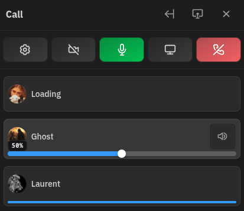
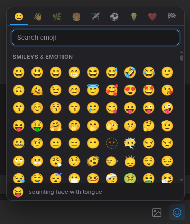
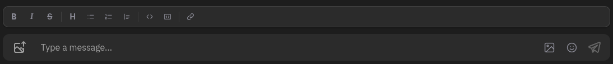

# Chatto Enhancer

A browser extension that adds quality-of-life features to Chatto.

This is an unofficial, community-made extension built for [Chatto](https://github.com/chattocorp/chatto). It is not affiliated with the Chatto project or ChattoCorp.

## Features

- 🔊 Individual participant volume controls
- 😀 Emoji picker with recent emojis
- ✍️ Markdown formatting toolbar, docked above the message box
- 🎞️ GIF picker (Giphy search) with favorites
- ⚡ Lightweight and fast
- 🌐 Chromium and Firefox support

## Screenshots

## Privacy

- No telemetry
- No analytics
- No tracking
- No remote scripts
- The GIF picker sends search queries and fetches images from Giphy (`api.giphy.com`) when you use it — no other runtime network requests are made
- Preferences and favorited GIFs are stored locally using the browser storage API

## Installation

### Chromium

1. Download the latest release.
2. Extract the ZIP.
3. Open `chrome://extensions`
4. Enable Developer Mode.
5. Click Load unpacked.
6. Select the extracted folder.

### Firefox (Development)

1. Open `about:debugging`
2. Select "This Firefox"
3. Click "Load Temporary Add-on"
4. Select `manifest.json`

Temporary add-ons are removed whenever Firefox is closed or restarted.

### Firefox (Permanent installation)

Permanent installation requires a signed extension.

Once Chatto Enhancer is published on Mozilla Add-ons (AMO), users will be able to install it permanently with normal Firefox updates.

Until then, use the temporary installation above for testing.

## License

MIT. See [LICENSE](LICENSE).
